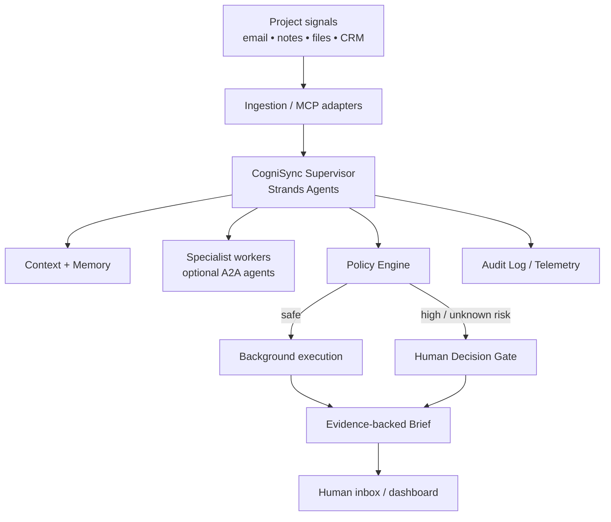

# CogniSync Professional

> **A background professional agent that turns project noise into decision-ready work — without turning the human into the agent's operator.**

CogniSync is a Strands Agents–based prototype for the **Agents for Humans Hackathon 2026 — Professional Agents** track. It is designed around one principle: **autonomy should absorb repetitive work, while human attention is reserved for consequential decisions.**

The hackathon asks entrants to build a new agent with Strands Agents SDK that does real work for people, preferably operating quietly in the background and surfacing only when a genuine decision is required. The submission also requires a public repository, README, architecture diagram, MIT/Apache license, and a maximum five-minute demo video. AgentCore deployment is explicitly encouraged because it strengthens the Technical Implementation score. citeturn437470view0turn437470search2

## What CogniSync does

CogniSync is aimed at creators, consultants, freelancers and small professional teams who repeatedly process the same project signals:

- incoming messages and notes;
- project status changes;
- client follow-ups;
- reporting and brief generation;
- preparation of decisions that still belong to a human.

The prototype implements a **background work loop** with five explicit guarantees:

1. **Evidence before action** — the agent carries source references into each insight.
2. **Least privilege** — known-safe analysis can run without interruption.
3. **Fail-closed autonomy** — unknown or externally consequential actions require approval.
4. **Decision compression** — the human receives a small decision packet instead of a stream of agent chatter.
5. **Auditability** — each run and each autonomy gate produces an append-only JSONL event.

## Why this is different

Most assistant UX asks the human to continuously manage the AI: open it, feed it context, approve dozens of small actions, and keep checking progress. CogniSync inverts that relationship.

The agent is responsible for **monitoring → synthesizing → preparing → waiting**. The human is responsible for **deciding** only where the consequences matter.

This is deliberately not positioned as "full autonomy at any cost." The product thesis is **bounded autonomy with high information quality**.

## Technical architecture



The production design is intentionally compatible with Amazon Bedrock AgentCore Runtime, AgentCore Memory, AgentCore Gateway/MCP and A2A. AgentCore Runtime supports framework-agnostic deployment and MCP/A2A communication; AWS documents A2A servers on port 9000 with Agent Cards and JSON-RPC. citeturn888617search8turn888617search0turn888617search2

AgentCore Gateway provides a managed entry point for MCP tools and handles authentication and invocation of configured targets. citeturn493810search2turn493810search11

AgentCore Memory provides built-in strategies including user preferences, semantic memory and session summaries. The Strands integration supports short-term conversation persistence plus long-term memory. citeturn493810search3turn493810search4turn916868search2

Strands 1.0 introduced production-oriented multi-agent primitives and A2A support; the current Strands documentation also exposes an `A2AAgent` client abstraction for remote agents. citeturn888617search5turn493810search0

## Repository structure

```text
.
├── cognisync/
│   ├── __init__.py
│   ├── agent.py          # optional real Strands/Bedrock adapter
│   ├── audit.py          # append-only audit trail
│   ├── cli.py            # runnable prototype CLI
│   ├── engine.py         # background orchestration core
│   ├── models.py         # domain model + risk taxonomy
│   ├── policy.py         # fail-closed autonomy policy
│   └── store.py          # replaceable local persistence
├── data/
│   └── brief.json        # safe synthetic demo input
├── docs/
│   ├── ARCHITECTURE.md
│   ├── DEMO_SCRIPT.md
│   └── GRANT_PROPOSAL.md
├── tests/
│   ├── test_engine.py
│   └── test_policy.py
├── .gitignore
├── LICENSE
├── pyproject.toml
└── README.md
```

## Run the deterministic prototype

The local core is intentionally runnable without an AWS account. This makes the repository testable by judges before cloud credentials are configured.

```bash
python -m venv .venv
source .venv/bin/activate
pip install -e '.[dev]'
pytest -q
python -m cognisync.cli --pretty
```

To test the decision gate:

```bash
COGNISYNC_SEND=1 python -m cognisync.cli --pretty
```

The expected behavior is not to send anything. CogniSync emits a `decision_required` result and records a `decision.gated` audit event.

## Optional AWS / Strands runtime

Install the AWS dependencies:

```bash
pip install -e '.[aws]'
```

Then set a supported Bedrock model identifier through `COGNISYNC_MODEL_ID` and construct the production adapter with `cognisync.agent.build_strands_agent()`.

The current AWS architecture should use official AgentCore entry points and configuration generated by the AgentCore tooling rather than hard-coding guessed command flags. AWS currently documents `agentcore create` for A2A projects and `agentcore deploy` for deployment. citeturn888617search0

## Security model

The original concept is strengthened here by making the security boundary explicit:

- no API keys in prompts or repository files;
- external side effects are never treated as safe-by-default;
- unknown operations fail closed;
- project evidence is retained with each decision request;
- audit events are append-only;
- the local prototype uses synthetic data.

For agent shell execution, the current Strands ecosystem also provides a sandboxed Strands Shell with default-deny filesystem/network behavior. It is a mediation layer rather than a hardened OS sandbox, so the deployment threat model must state this distinction explicitly. citeturn916868search1turn916868search6

## Evaluation strategy

CogniSync should be evaluated on both useful work and restraint:

**Product metrics**
- repetitive actions removed from the professional's workflow;
- time from input arrival to decision-ready brief;
- number of notifications per workday;
- percentage of routine tasks completed without intervention;
- human approval precision for high-impact actions.

**Agent metrics**
- task success;
- evidence / provenance coverage;
- unsafe tool-call refusal;
- false escalation rate;
- recovery after tool failure;
- cost per completed workflow.

The Strands Evals ecosystem supports output and trajectory evaluation, tool-use assessment, trace-based evaluation, failure analysis, chaos testing and red-team evaluation. citeturn493810search9turn493810search6

## Submission alignment

CogniSync targets the **Professional Agents** track: professionals, makers, creators and small-business owners, especially repetitive and judgment-heavy work. This directly matches the published track definition and the hackathon's requirement that the agent do real work end-to-end. citeturn437470view0

The project is designed against the five equally weighted judging criteria:

| Criterion | Evidence in this repo |
|---|---|
| Technical Implementation | Strands-based core, real agent adapter, safety policy, tests, AgentCore-ready architecture |
| Design | Clear background-first workflow and decision packet model |
| Potential Impact | Concrete professional workflow and measurable metrics |
| Creativity & Originality | Human attention is treated as the scarce resource; autonomy is bounded by consequence |
| Presentation | Demo script, architecture, deterministic local run, cloud path |

## Limitations and honest scope

This repository contains a **functional local prototype and a production-oriented architecture**, not a claim that a live AWS deployment has already been provisioned. Cloud credentials, account configuration, external MCP targets, notification channels and a deployed runtime remain environment-specific.

That distinction is intentional: a judge can run the core locally, inspect its safety behavior, then map the same orchestration layer to AgentCore without mistaking documentation for deployed infrastructure.

## License

MIT.
