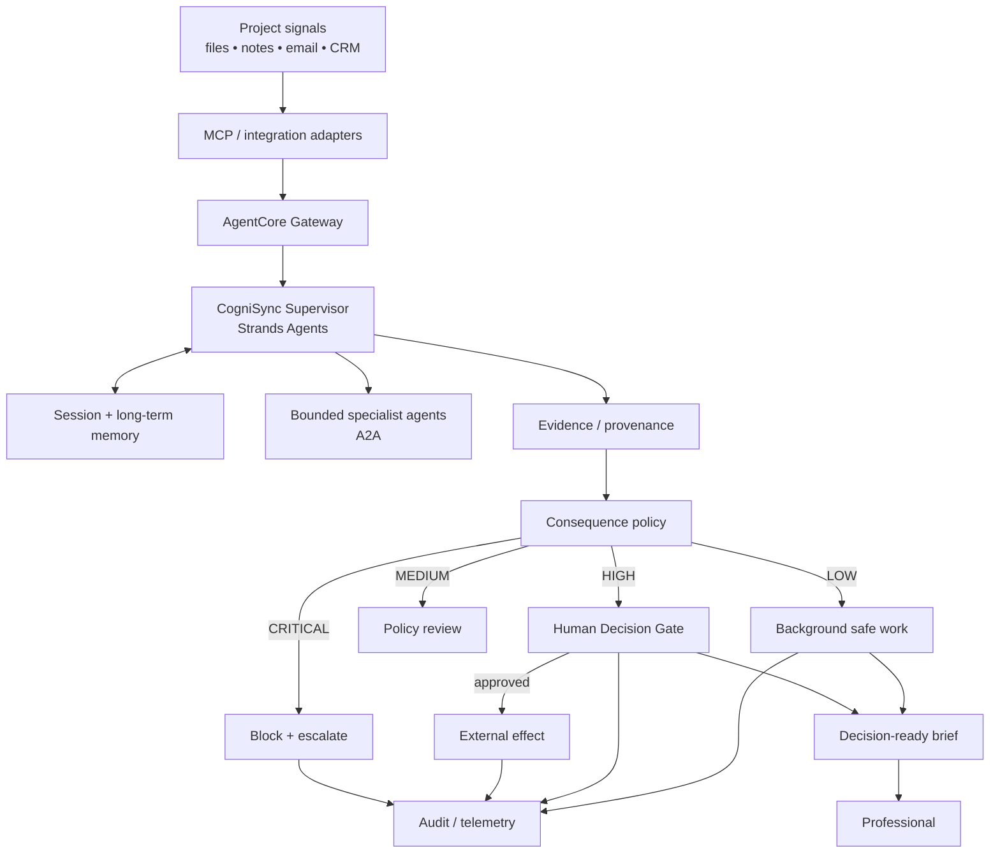

# CogniSync Professional

> **A background professional agent that turns project noise into decision-ready work — without turning the human into the agent's operator.**

CogniSync is a submission-ready prototype for the **Agents for Humans Hackathon 2026 — Professional Agents** track. The project follows the hackathon's central pattern: repetitive work happens in the background; the human is surfaced when a consequential decision actually matters. The submission deadline is **September 14, 2026 at 5:00 p.m. PDT**. citeturn993163search0turn993163search9

## The product idea

Professional work generates a constant stream of low-value coordination: reading updates, identifying what changed, finding blockers, drafting reports, preparing follow-ups and deciding what deserves attention.

CogniSync inverts the normal assistant relationship:

**Signals → background reasoning → evidence → consequence policy → human decision**

The agent owns repetition. The human owns consequence.

## What is implemented

- deterministic local background workflow;
- evidence-backed project analysis;
- explicit least-privilege risk policy;
- centralized Human-in-the-Loop decision gate;
- fail-closed handling of unknown actions;
- append-only JSONL audit trail;
- provenance hashing for source records;
- background heartbeat scheduler;
- CLI and five-minute judgeable demo;
- Strands/Bedrock adapter;
- automated tests and CI;
- AgentCore-oriented architecture documentation;
- professional English grant application.

The repository contains a runnable local core so judges do not need cloud credentials to inspect the system's central behavior. The cloud path is explicitly documented rather than falsely presented as already provisioned. fileciteturn4file0L2-L6

## Quick start

```bash
python -m venv .venv
source .venv/bin/activate
pip install -e '.[dev]'
pytest -q
python -m cognisync --pretty
```

The package is directly executable through `python -m cognisync`.

## Prove the safety boundary

```bash
python -m cognisync --demo-gate --pretty
```

Expected behavior:

```text
status: decision_required
risk: high
action: send_external_message
```

Nothing is sent. The decision packet contains the proposed action, reason, evidence and payload context.

Resolve the local demo transition:

```bash
python -m cognisync --demo-gate --approve --pretty
```

Approval records the decision in the audit trail. The prototype still does not fake external completion.

## Architecture



Amazon Bedrock AgentCore Runtime is designed for secure serverless agent execution, with support for Strands and other frameworks, model flexibility, MCP and A2A. AgentCore Gateway provides the managed MCP integration boundary and supports inbound/outbound authorization. citeturn993163search6turn903350search7turn903350search8

AWS also documents AgentCore-hosted A2A servers using `StrandsA2AExecutor` and `serve_a2a`, with Agent Cards and JSON-RPC. citeturn993163search2turn993163search7

## Memory strategy

The production design separates active session context from durable knowledge. AgentCore Memory currently documents built-in strategies for semantic memory, user preferences and summarization, including Strands integration. citeturn993163search5

Memory is contextual support, not authorization. Every consequential decision still carries current-run evidence.

## Security model

CogniSync uses a **fail-closed consequence taxonomy**:

| Risk | Examples | Default |
|---|---|---|
| Low | read, classify, summarize, draft | autonomous |
| Medium | reversible internal preparation | policy-dependent |
| High | send, publish, modify records, payment | human approval |
| Critical | unknown, destructive, privilege escalation | block + escalate |

This policy was part of the original repository foundation and remains explicit in the code. fileciteturn7file0L1-L6

AgentCore Gateway supports OAuth, IAM and API-key authorization patterns. For remote resource reads, AWS warns about SSRF/local-file risks and recommends allowlisting trusted resource URI schemes and patterns. citeturn903350search1turn903350search9

For shell execution, any local mediation layer must not be described as an OS-level security boundary. Production isolation belongs in the hosted execution environment and IAM model.

## Evaluation

CogniSync is evaluated on both **usefulness and restraint**:

| Metric | Direction |
|---|---|
| repetitive minutes removed | up |
| signal-to-brief latency | down |
| unnecessary interventions | down |
| important claims with evidence | up |
| unauthorized external actions | zero |
| correct high-impact escalation | up |
| cost per workflow | down |
| fault recovery | up |

The test suite covers normal analysis, safety classification, human decision resolution and audit behavior. The architecture also supports a broader adversarial program including prompt injection, malformed tool output, duplicate events, missing context and timeout recovery.

## Repository map

```text
.
├── cognisync/
│   ├── agent.py          # Strands / Bedrock adapter
│   ├── analysis.py       # deterministic signal extraction
│   ├── audit.py          # append-only audit events
│   ├── cli.py            # executable prototype interface
│   ├── decision.py       # centralized human decision gate
│   ├── engine.py         # background orchestration
│   ├── evidence.py       # provenance records / content hashes
│   ├── heartbeat.py      # background scheduler
│   ├── models.py         # domain types + risk levels
│   ├── policy.py         # fail-closed authorization policy
│   └── store.py          # local persistence adapter
├── data/brief.json       # synthetic demo signal
├── docs/
│   ├── ARCHITECTURE.md
│   ├── DEMO.md
│   ├── DEMO_SCENARIO_V2.md
│   ├── GRANT_PROPOSAL.md
│   └── ...
├── tests/
├── .github/workflows/ci.yml
├── LICENSE
├── pyproject.toml
└── README.md
```

## Production path

The intended cloud progression is:

1. Strands supervisor in AgentCore Runtime;
2. AgentCore Memory for session continuity and durable personalization;
3. AgentCore Gateway for authenticated MCP tools;
4. bounded specialist workers over A2A;
5. telemetry and continuous evaluation.

AWS currently documents `agentcore create` and `agentcore deploy` as official project/deployment workflows. For A2A, the documented runtime contract uses a streamable HTTP server on port 9000. citeturn993163search2

## Submission alignment

The hackathon is a public Devpost event with a **$40,000 cash prize pool**. The Professional Agents track is specifically aimed at repetitive professional tasks such as scheduling, follow-ups and reporting. citeturn993163search1turn993163search8

CogniSync is designed around the judging dimensions implied by the event:

- **Technical implementation:** runnable agent core, Strands integration point, tests, safety policy, AgentCore architecture;
- **Design:** background-first and exception-driven human interaction;
- **Potential impact:** measurable reduction in coordination overhead;
- **Creativity:** consequence-aware autonomy and human attention as a design objective;
- **Presentation:** short reproducible demo with observable safety behavior.

## Grant proposal

The full professional English proposal is maintained in [`docs/GRANT_PROPOSAL.md`](docs/GRANT_PROPOSAL.md).

## Demo

The complete five-minute narrative is in [`docs/DEMO_SCENARIO_V2.md`](docs/DEMO_SCENARIO_V2.md). It demonstrates the central thesis without pretending that a local approval created a real-world side effect.

## License

MIT.
