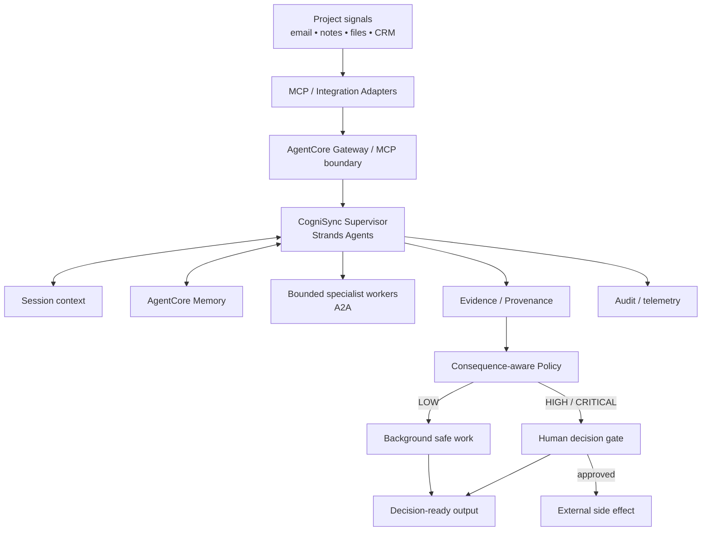

# CogniSync Professional

> **A background professional agent that turns project noise into decision-ready work — without turning the human into the agent's operator.**

CogniSync is a Strands Agents–based prototype for the **Agents for Humans Hackathon 2026 — Professional Agents** track. The design principle is explicit: **autonomy should absorb repetitive work while human attention is reserved for consequential decisions.**

## Why CogniSync

Most assistants make the human operate the AI: open it, provide context, approve intermediate actions, and repeatedly ask for status.

CogniSync reverses the relationship:

**observe → interpret → prepare → evaluate consequence → act or wait → surface**

The agent works quietly. The human receives a compact decision packet only when attention has actual value.

## The core promise

CogniSync does four things especially well:

- **Background work:** reads and synthesizes project signals without requiring constant prompting.
- **Evidence-backed intelligence:** important insights retain source references and confidence.
- **Consequence-aware autonomy:** safe work is autonomous; external or destructive effects require authorization.
- **Auditability:** important transitions are recorded as structured events.

The prototype is intentionally honest about scope: local execution is fully reproducible; cloud integrations are production architecture targets rather than claims of already-provisioned infrastructure.

## What the prototype demonstrates

The repository contains a deterministic local core that can:

1. load synthetic project information;
2. analyze it into evidence-backed insights;
3. produce a decision-ready background brief;
4. detect requests for consequential actions;
5. classify the requested action through a model-independent policy;
6. fail closed for unknown side effects;
7. create a human decision request;
8. record the workflow in an append-only JSONL audit trail;
9. simulate approval without pretending that a real-world action occurred.

## Run it

```bash
python -m venv .venv
source .venv/bin/activate
pip install -e '.[dev]'
pytest -q
python -m cognisync --pretty
```

The judge-friendly end-to-end scenario is:

```bash
python -m scripts.demo
```

To explicitly exercise the external-action gate:

```bash
python -m cognisync --demo-gate --pretty
```

The system must return `decision_required`; no real external message is sent by the local prototype.

## Architecture



The production architecture is designed around Strands Agents, Amazon Bedrock AgentCore Runtime, AgentCore Memory, AgentCore Gateway/MCP and optional A2A specialist workers. The repository deliberately keeps the policy boundary independent of the model so a model output never becomes authorization by itself.

## Safety invariants

- Unknown actions are **critical risk** and never auto-execute.
- External communication, publication, CRM/calendar changes, payments and destructive operations require approval.
- The model is not the authorization layer.
- External completion must be confirmed by the connector before it is reported as complete.
- Credentials do not belong in prompts or repository files.
- Local demo data is synthetic.

See [`docs/THREAT_MODEL.md`](docs/THREAT_MODEL.md) for the trust boundaries and residual risk assumptions.

## Evaluation philosophy

CogniSync is evaluated on both **usefulness** and **restraint**.

| Dimension | Question |
|---|---|
| Task success | Did the agent prepare the right work product? |
| Evidence coverage | Can an important claim be traced to source material? |
| Safe autonomy | Did routine work complete without needless approval? |
| Escalation precision | Did consequential work stop at the correct boundary? |
| Safety | Was any unauthorized side effect executed? |
| Resilience | Did failure produce a safe, inspectable state? |
| Efficiency | What useful work was produced per unit of model/human cost? |

The release matrix is in [`docs/EVALUATION_MATRIX.md`](docs/EVALUATION_MATRIX.md).

## Production evolution

The next deployment stages are:

1. **Local judgeable core** — deterministic and testable without AWS credentials.
2. **Real Strands / Bedrock execution** — configurable model adapter.
3. **AgentCore Runtime** — hosted background execution.
4. **AgentCore Memory** — session continuity and durable preference/semantic context.
5. **AgentCore Gateway / MCP** — controlled integration boundary for professional tools.
6. **A2A specialists** — bounded delegation where measurable value exists.
7. **Continuous evaluation** — regression, adversarial and fault-injection suites.

Production deployment should use current AWS/Strands tooling and pin the exact SDK/CLI versions used by the target environment rather than relying on stale examples.

## Repository map

```text
.
├── cognisync/
│   ├── agent.py           # optional Strands/Bedrock adapter
│   ├── analysis.py        # deterministic signal analysis
│   ├── audit.py           # append-only audit events
│   ├── cli.py             # command-line entry point
│   ├── config.py          # environment configuration
│   ├── decision.py        # human decision gate
│   ├── engine.py          # background orchestration
│   ├── evidence.py        # provenance helpers
│   ├── health.py          # health/readiness helper
│   ├── heartbeat.py       # background heartbeat abstraction
│   ├── models.py          # domain models
│   ├── policy.py          # fail-closed action policy
│   └── store.py            # replaceable local persistence
├── data/
│   └── brief.json         # synthetic demonstration input
├── docs/
│   ├── ARCHITECTURE.md
│   ├── BUILD_NOTES.md
│   ├── DEMO.md
│   ├── DEMO_SCENARIO_V2.md
│   ├── DEMO_SCENARIO.md
│   ├── DEMO_SCRIPT.md
│   ├── EVALUATION_MATRIX.md
│   ├── GRANT_PROPOSAL.md
│   ├── SUBMISSION_CHECKLIST_V2.md
│   ├── SUBMISSION_CHECKLIST.md
│   └── THREAT_MODEL.md
├── scripts/
│   └── demo.py            # one-command judge demo
├── tests/
├── .github/workflows/ci.yml
├── LICENSE
└── pyproject.toml
```

## Submission package

- [`docs/GRANT_PROPOSAL.md`](docs/GRANT_PROPOSAL.md) — full professional English application.
- [`docs/ARCHITECTURE.md`](docs/ARCHITECTURE.md) — technical architecture and deployment progression.
- [`docs/DEMO_SCENARIO_V2.md`](docs/DEMO_SCENARIO_V2.md) — five-minute demo narrative.
- [`docs/THREAT_MODEL.md`](docs/THREAT_MODEL.md) — threat model and security invariants.
- [`docs/EVALUATION_MATRIX.md`](docs/EVALUATION_MATRIX.md) — release and red-team gates.
- [`docs/SUBMISSION_CHECKLIST_V2.md`](docs/SUBMISSION_CHECKLIST_V2.md) — submission readiness checklist.

## Integrity statement

This repository distinguishes three states that must never be conflated:

**prepared** ≠ **authorized** ≠ **executed**

That distinction is central to the product. CogniSync is not trying to maximize the number of actions taken by an agent. It is trying to maximize useful work completed while minimizing the amount of human attention required to supervise it.

## License

MIT.
