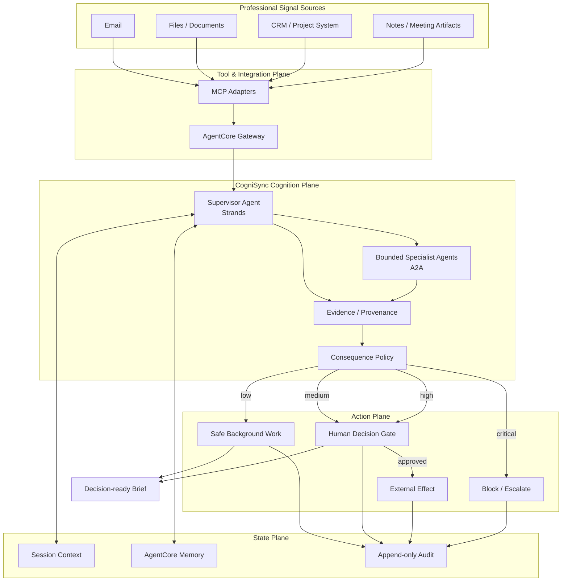

# CogniSync Professional — Architecture Specification

## 1. Design objective

CogniSync is a background-first professional agent. Its architecture separates **cognitive work** from **consequential execution**.

### Core invariant

> The agent may inspect, classify, summarize and prepare autonomously. It may not silently create externally consequential side effects.

## 2. Runtime topology

## 3. Separation of concerns

CogniSync treats three questions independently:

1. **What is known?** — evidence, source records and context.
2. **What should happen?** — agent reasoning and planning.
3. **Is it authorized now?** — explicit consequence policy.

This prevents a correct model inference from being treated as automatic authorization.

## 4. Strands layer

Strands is the orchestration layer. It owns the agent loop, model interaction and tool use. The project keeps the deterministic safety policy outside the model so that changing models does not silently change authorization rules.

The live adapter exposes a narrow integration point in `cognisync.agent`, while the local engine remains deterministic and judgeable.

## 5. Memory layer

The production design uses:

- session context for the active workflow;
- AgentCore Memory for durable summaries, semantic facts and stable user preferences.

Memory can improve continuity but does not grant authority. Important decisions retain current-run evidence.

## 6. MCP / Gateway layer

AgentCore Gateway is the integration perimeter for professional systems. It can expose MCP tool surfaces and apply inbound/outbound authorization. Provider-specific credentials remain at this boundary rather than entering prompts or model context.

Remote resource identifiers should be constrained to trusted schemes and patterns to reduce SSRF/local-resource risks.

## 7. A2A specialist layer

A2A is used only when bounded specialization creates measurable value. Example workers include classification, document structure extraction, reporting and quality review.

The supervisor should delegate narrow tasks rather than create an unconstrained agent swarm.

## 8. Safety policy

| Risk | Examples | Default |
|---|---|---|
| Low | read, classify, summarize, draft | autonomous |
| Medium | reversible internal preparation | policy-dependent |
| High | send, publish, modify records, payment | approval |
| Critical | unknown, destructive, privilege escalation | block + explicit decision |

The local implementation lives in `cognisync/policy.py` and is tested independently.

## 9. Audit and provenance

Each meaningful workflow produces machine-readable audit events. Source records can also be represented by provenance hashes. The target event chain is:

`run → analysis → evidence → policy → decision → effect`

Production telemetry should preserve the same correlation ID across all distributed components.

## 10. Failure handling

The design explicitly handles:

- empty input — remain idle rather than fabricate work;
- unknown action — classify as critical;
- tool timeout — retry only if policy allows, otherwise fail safely;
- malformed tool result — no false completion;
- external side effect — require connector confirmation;
- prompt injection — treat external content as untrusted data, never authority.

## 11. Deployment progression

### Stage A — local judgeable prototype

No AWS credentials required. Run tests and deterministic demo.

### Stage B — Bedrock model

Install the AWS extra and configure a supported model ID.

### Stage C — AgentCore Runtime

Use the current AgentCore CLI/project scaffolding and deployment workflow. AWS currently documents A2A deployment with `StrandsA2AExecutor` and `serve_a2a`, with port 9000 as the default A2A server port. 

### Stage D — real MCP integrations

Connect narrowly scoped professional systems through AgentCore Gateway with explicit authorization.

### Stage E — bounded A2A specialization

Introduce remote specialist agents only where benchmarks demonstrate a measurable advantage.

### Stage F — continuous evaluation

Run regression, adversarial and fault-injection evaluation on each meaningful change.
