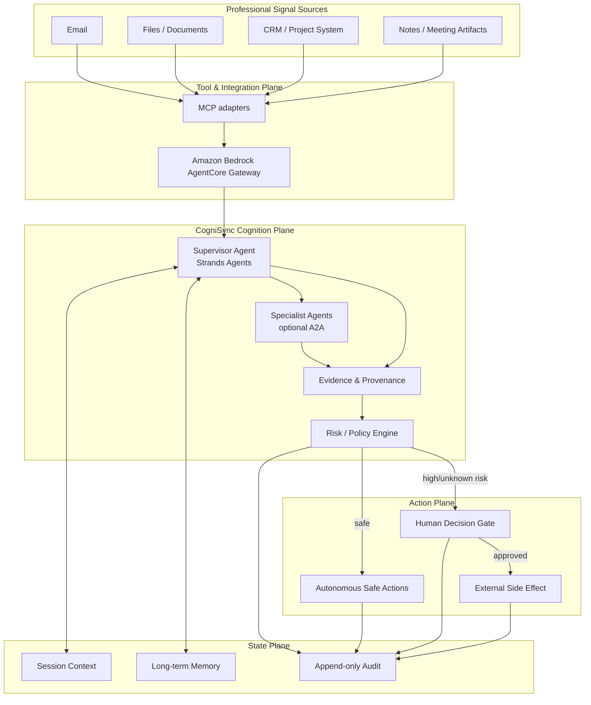

# CogniSync Professional — Architecture Specification

## 1. Design objective

CogniSync is a background-first professional agent. Its architecture separates **cognitive work** from **consequential execution**.

The central invariant is:

> The agent may autonomously inspect, classify, summarize and prepare. It may not silently create externally consequential side effects.

## 2. Runtime topology

## 3. Why the separation matters

A conventional agent often conflates three questions:

1. What information is available?
2. What should be done?
3. Is the system authorized to do it now?

CogniSync models these independently. This reduces the probability that a correct inference accidentally becomes an unauthorized side effect.

## 4. Strands layer

Strands is the agent orchestration layer. It owns the agent loop, tool selection and model interaction. Strands' current documentation describes invocation limits, cancellation, concurrent-invocation protection, hooks and retry strategies as part of the agent loop. citeturn493810search1

Strands 1.0 also added multi-agent primitives and A2A support. Remote agents can be consumed through `A2AAgent`. citeturn888617search5turn493810search0

## 5. Memory layer

The production implementation can use AgentCore Memory. Built-in strategies cover user preferences, semantic facts and session summaries; the Strands session-manager integration supports STM and LTM with batching and explicit/automatic flush behavior. citeturn493810search3turn493810search4turn916868search2

Memory is not treated as an unrestricted source of truth. Important external decisions retain explicit evidence in the current run.

## 6. MCP / gateway layer

AgentCore Gateway is the integration boundary. It gives the agent a unified MCP tool surface and manages authentication and target invocation. citeturn493810search2turn493810search11

This boundary is the correct location for provider-specific credentials and integration policy. Application code should receive tool results, not raw API credentials.

## 7. A2A specialist workers

A2A is used only when decomposition creates an operational advantage. Examples:

- classification worker;
- document-structure worker;
- reporting worker;
- quality/review worker.

The supervisor should delegate bounded tasks instead of spawning unconstrained agent swarms. AWS documents AgentCore Runtime support for A2A with stateless streamable HTTP on port 9000, Agent Cards, JSON-RPC and supported authentication schemes. citeturn888617search0turn888617search2

## 8. Safety model

CogniSync uses a fail-closed action taxonomy:

| Risk | Examples | Default |
|---|---|---|
| Low | read, classify, summarize, draft | autonomous |
| Medium | internal reversible preparation | policy-dependent |
| High | send, publish, modify CRM/calendar, payment | approval |
| Critical | unknown capability, destructive/privilege escalation | block + approval |

The local prototype implements this policy in `cognisync/policy.py`.

## 9. Execution isolation

For file/shell work, the current Strands ecosystem includes Strands Shell, whose default policy provides an in-process virtual filesystem and deny-by-default network/credential handling. AWS AgentCore Runtime remains the stronger production isolation boundary for hosted workloads. Strands Shell is explicitly a mediation layer, not a hardened OS sandbox, so the threat model must not overstate its guarantees. citeturn916868search1turn916868search6

## 10. Observability and evaluation

Every run emits machine-readable audit events. In production, OpenTelemetry traces should correlate:

`run_id → agent decision → tool call → policy decision → human gate → final effect`

Evaluation should include cooperative, adversarial and fault-injection scenarios. Strands Evals supports trajectory/tool-use evaluation, trace analysis, failure diagnosis, chaos testing and red-team evaluation. citeturn493810search9turn493810search6

## 11. Deployment progression

### Stage A — local judgeable prototype

No AWS credentials required. Run unit tests and deterministic sample workflow.

### Stage B — Bedrock model

Install the AWS extra and configure a Bedrock model ID.

### Stage C — AgentCore Runtime

Use the AgentCore CLI/project scaffolding and deploy the agent. For A2A deployments, follow the current AgentCore contract instead of relying on hard-coded legacy examples. citeturn888617search0turn888617search2

### Stage D — real MCP integrations

Connect selected professional systems through AgentCore Gateway. Keep each target narrowly scoped and auditable.

### Stage E — continuous evaluation

Run regression, chaos and adversarial suites on every production change.
