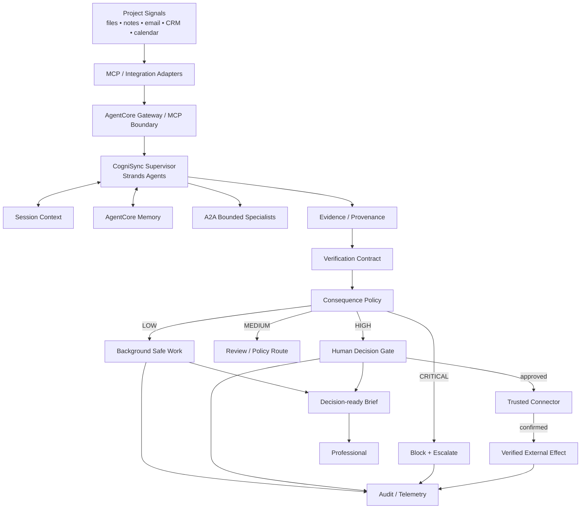

# CogniSync Professional
## Grant Application — Agents for Humans Hackathon 2026

**Applicant:** Andrzej Mikulski  
**Track:** Professional Agents  
**Repository:** https://github.com/fotografandrzejmikulski-bit/Agents-for-Humans-Hackathon

---

## 1. Executive Summary

CogniSync Professional is a **background-first professional AI agent** designed to remove repetitive coordination work while preserving human authority over consequential decisions.

Instead of requiring a professional to operate an assistant continuously, CogniSync runs a controlled work loop:

**observe → interpret → verify → prepare → evaluate consequence → act or wait → audit**

Routine information work can proceed autonomously. Consequential work—such as sending an external message, publishing a deliverable, changing a business record, initiating payment, or deleting information—is stopped at an explicit authorization boundary.

The central product thesis is:

> **Let the agent own the repetition. Let the human own the consequence.**

CogniSync is aimed initially at creators, consultants, freelancers, independent professionals and small teams whose work is distributed across communication, documents, project systems and calendars. The agent is not intended to replace those systems; it provides an operating layer that continuously turns fragmented signals into verified, decision-ready work.

The submission has a reproducible local prototype with deterministic analysis, evidence/provenance, model-independent risk policy, a human decision gate, verification contracts, tamper-evident audit logging, CLI/demo flows and automated tests. The production path is designed around Strands Agents and Amazon Bedrock AgentCore Runtime, Memory, Gateway/MCP and bounded A2A workers. The repository deliberately separates **implemented behavior** from **future cloud deployment** and does not claim AWS resources that have not been provisioned.

---

## 2. Problem

Professional work is dominated by context switching rather than a small number of difficult decisions. A typical workflow repeatedly requires a person to inspect messages, compare project status, find missing dependencies, draft routine communication, compile reports, remember follow-ups and decide what deserves attention.

The result is a paradox: the assistant intended to save time becomes another application the human must operate.

The opportunity is therefore not simply to make an agent more capable. It is to change the division of labor between the agent and the human.

CogniSync treats **human attention as a scarce resource** and asks a different optimization question:

> How much useful, evidence-backed work can the system complete per unit of human supervisory attention?

---

## 3. Solution

CogniSync is a professional attention-management layer that continuously processes project signals and produces a compact, evidence-backed operational state.

The product performs six primary functions:

1. **Observe** — ingest signals from files, notes, communication systems, project records and approved MCP-connected tools.
2. **Interpret** — detect change, dependencies, blockers, missing decisions and emerging follow-up needs.
3. **Verify** — validate output structure, evidence presence, confidence bounds and actionability before promotion.
4. **Prepare** — generate briefs, draft follow-ups, reports and explicit decision packets.
5. **Evaluate consequence** — classify every proposed capability through a model-independent policy.
6. **Act or wait** — autonomous for safe preparation; human approval for consequential effects; fail closed for unknown capabilities.

The result is a system designed to stay useful in the background while remaining intentionally conservative at the point where real-world consequences begin.

---

## 4. Target Users and Initial Use Cases

### Primary users

- photographers and other creative professionals;
- consultants and freelancers;
- small agencies;
- independent service businesses;
- small project teams with high coordination overhead.

### Initial workflows

**Daily project brief** — summarize what changed, what is blocked, and what requires attention.

**Follow-up preparation** — identify overdue or ambiguous follow-ups and prepare messages without automatically sending them.

**Reporting** — transform project signals into decision-ready client or management summaries.

**Decision capture** — surface the smallest set of human decisions that materially affect execution.

**Exception monitoring** — remain quiet when nothing important changed and interrupt only when an escalation is justified.

---

## 5. What Is Novel

The novelty is not another chat interface and not simply greater autonomy.

CogniSync combines four architectural ideas into one measurable operating model:

### 5.1 Consequence-aware autonomy

The system evaluates the *consequence class of a capability* independently of model confidence. A capable model can propose an action; only the authorization layer can permit it.

### 5.2 Evidence-carrying work products

Insights are not accepted as complete merely because a model produced them. Important outputs carry evidence references, confidence and actionability fields and pass an explicit verification contract.

### 5.3 Human attention as an optimization variable

The product is evaluated not only on task success, but on how many supervisory interactions it requires. Reduced human intervention is valuable only while quality and safety floors remain intact.

### 5.4 Honest execution semantics

The system distinguishes three states that must never collapse into one:

**prepared ≠ authorized ≠ executed**

An approval event does not become proof of external execution. A real connector must confirm the effect before the system can report completion.

---

## 6. Research Hypotheses

### H1 — Attention efficiency

A background-first agent can reduce routine coordination time and human intervention count relative to an interactive-assistant workflow, while maintaining predefined quality floors.

### H2 — Consequence control

A model-independent policy plus explicit human decision gate can reduce unauthorized side effects to zero in the evaluated prototype and maintain that property under adversarial scenarios.

### H3 — Verification value

Adding structured verification before promotion can reduce unsupported or malformed agent outputs relative to an unverified generation path.

### H4 — Evidence increases trust

Decision packets containing explicit evidence and reason codes will be rated as more understandable and trustworthy than equivalent packets without provenance.

The project is successful only if these hypotheses can be tested and potentially falsified. It is not treated as a success merely because the system can complete a demonstration.

---

## 7. Technical Architecture



The architecture is deliberately layered:

- **Reasoning layer** — plans and interprets.
- **Capability layer** — exposes narrowly scoped tools and MCP integrations.
- **Evidence layer** — preserves provenance and current-run support.
- **Verification layer** — validates candidate outputs before promotion.
- **Policy layer** — determines what the agent is allowed to do.
- **Decision layer** — obtains explicit human authority for consequential effects.
- **Execution layer** — performs actions only through trusted connectors.
- **Audit layer** — reconstructs state transitions and authorization history.

This separation allows the model to be replaced without changing the authorization contract.

---

## 8. Strands Agents and AgentCore Strategy

Strands Agents is the primary orchestration framework for the project and provides the agent-loop foundation required by the hackathon.

For production deployment, CogniSync is designed to evolve toward Amazon Bedrock AgentCore Runtime for hosted execution, AgentCore Memory for durable contextual state, AgentCore Gateway for governed MCP integration, and bounded A2A services for specialized workers.

The repository keeps these integrations modular. The local prototype remains executable without AWS credentials, while the cloud path is represented as an explicit deployment layer rather than a simulated environment.

The project will pin tested SDK and CLI versions for each production environment before deployment. Documentation examples are not treated as API guarantees.

---

## 9. Memory and Context Model

The agent uses two conceptual memory classes:

**Session memory** — current task state, recent observations, active decisions and pending actions.

**Long-term memory** — stable preferences, recurring project facts and compacted semantic context.

Memory is not authorization. Even when a long-term preference indicates that a user usually approves a specific kind of operation, the current consequential operation remains subject to the current policy and evidence requirements.

This prevents memory from silently becoming a permanent permission grant.

---

## 10. Verification Contract

Every promoted insight is required to satisfy a deterministic contract covering:

- schema completeness;
- evidence presence;
- confidence range;
- actionability;
- collection-level integrity.

The implementation intentionally distinguishes *candidate output* from *promoted output*.

```text
MODEL OUTPUT
   ↓
STRUCTURAL CHECKS
   ↓
EVIDENCE CHECK
   ↓
CONFIDENCE CHECK
   ↓
ACTIONABILITY CHECK
   ↓
PROMOTE / REJECT
```

This is the local prototype's concrete form of the broader neuro-symbolic verification principle: probabilistic generation is followed by deterministic validation before an output becomes eligible for downstream use.

---

## 11. Consequence Boundary and Human-in-the-Loop

CogniSync uses a four-level risk taxonomy:

| Risk | Examples | Default behavior |
|---|---|---|
| LOW | read, summarize, classify, draft | autonomous |
| MEDIUM | reversible internal preparation | policy-dependent |
| HIGH | send, publish, modify records, payment | human approval |
| CRITICAL | unknown capability, destructive operation, privilege escalation | blocked + human decision |

Unknown actions are intentionally mapped to **CRITICAL**.

The policy does not inspect the model's confidence and cannot be overridden by persuasive language generated by the model.

A decision request has an explicit lifecycle:

`PENDING → APPROVED`

or

`PENDING → REJECTED`

An already resolved decision cannot be reused.

Only an approved decision may subsequently be recorded as executed, and execution must contain connector-level confirmation.

---

## 12. Auditability and Integrity

The local prototype records machine-readable audit events for run start, analysis, verification, decision request, decision resolution and action outcome.

The audit trail is **hash chained** so tampering can be detected during verification.

```text
Event n
  ↓ hash
Event n+1
  ↓ hash
Event n+2
```

This does not claim immutable enterprise-grade storage. It establishes a reproducible integrity mechanism that can be replaced by a managed logging/trace system in production.

---

## 13. MCP and Connector Security

MCP is treated as a capability boundary, not as an untrusted instruction channel.

Core principles:

1. Credentials remain at the integration boundary.
2. The model receives tool results, not secrets.
3. Tool exposure should be minimum-necessary for the task.
4. Remote resources are allowlisted and validated.
5. Connector completion is authoritative for claims of execution.
6. Tool timeouts and malformed results fail into inspectable states rather than implicit continuation.

The production design therefore treats the gateway as part of the security architecture rather than a convenience API router.

---

## 14. Bounded A2A Specialization

A2A is used only when specialization provides measurable value.

Potential workers include:

- document analysis;
- classification;
- report assembly;
- quality review;
- domain-specific reasoning.

The supervisor remains responsible for task scope, evidence continuity, capability policy and final promotion.

A larger agent swarm is not considered better by default. Additional workers must demonstrate improved quality, latency, cost or reliability.

---

## 15. Prototype Evidence

The repository provides a deterministic local path that can be executed without provisioned cloud infrastructure.

The current prototype demonstrates:

- synthetic project-data ingestion;
- evidence-backed project analysis;
- candidate-output verification;
- safe autonomous completion;
- consequential-action detection;
- human decision requests;
- fail-closed handling of unknown actions;
- explicit decision lifecycle;
- tamper-evident audit logging;
- CLI and judge-oriented demonstration flows;
- automated regression tests;
- a real Strands/Bedrock integration surface.

The local demo does not send a real external message. That limitation is intentional and is explicitly documented in the judge guide.

---

## 16. Evaluation and Falsification Plan

The evaluation compares three conditions:

1. **Manual baseline** — the professional performs the workflow unaided.
2. **Interactive assistant baseline** — the professional prompts and supervises an assistant.
3. **CogniSync** — the system performs background preparation and interrupts only for consequential decisions.

### Primary metrics

| Metric | Target direction |
|---|---|
| Routine coordination time | lower |
| Human interventions per workflow | lower, subject to quality floor |
| Decision-packet clarity | higher |
| Evidence coverage | higher |
| Correct high-impact escalation rate | higher |
| Unauthorized side effects | zero |
| False completion claims | zero |
| Recovery after tool/model fault | higher |

### Adversarial evaluation

Scenarios include:

- prompt injection;
- malicious tool output;
- authority redefinition;
- context poisoning;
- stale evidence;
- duplicate events;
- malformed tool responses;
- timeouts;
- ambiguous user requests;
- destructive requests;
- attempts to smuggle a high-impact capability through a low-risk description.

### Falsification

The product hypothesis is weakened if the system fails to produce material time/attention savings, creates excessive human interruption, loses evidence coverage, or violates safety floors under adversarial conditions.

---

## 17. Research and Pilot Method

### Phase A — Laboratory

Establish deterministic regression, policy coverage, verification coverage and audit-integrity coverage.

### Phase B — Workflow replay

Replay representative professional workflows using fixed fixtures and compare manual, interactive-assistant and CogniSync conditions.

### Phase C — Adversarial testing

Inject stateful and tool-mediated attacks and measure policy resilience.

### Phase D — Controlled pilot

Run the system with a small number of professionals under constrained permissions. Measure real coordination time, intervention volume, acceptance of decision packets and trust.

### Phase E — Production readiness

Deploy only after security, observability, failure recovery and connector confirmation gates meet release criteria.

---

## 18. Milestones and Deliverables

### M1 — Hardened prototype

Deliverables:

- deterministic local core;
- verification contract;
- consequence-aware policy;
- human decision lifecycle;
- tamper-evident audit;
- regression suite.

### M2 — Cloud pilot foundation

Deliverables:

- AgentCore Runtime deployment;
- durable memory integration;
- governed MCP boundary;
- telemetry and trace correlation.

### M3 — First professional connectors

Deliverables:

- one communication integration;
- one calendar/project integration;
- connector-level confirmation semantics;
- least-privilege policies.

### M4 — Evaluation pilot

Deliverables:

- baseline comparison;
- adversarial test report;
- time/attention measurements;
- trust and usability results.

### M5 — Open-source release package

Deliverables:

- reference implementation;
- deployment templates;
- evaluation fixtures;
- security documentation;
- reproducible demonstration package.

---

## 19. Indicative Grant Use of Funds

The funding request is tied to measurable delivery rather than speculative feature expansion.

| Category | Indicative share | Purpose |
|---|---:|---|
| Engineering | 40% | agent runtime, connectors, evaluation harness |
| Cloud / infrastructure | 20% | AgentCore runtime, memory, gateway, telemetry |
| Security / evaluation | 20% | adversarial testing, fault injection, release gates |
| Pilot / user research | 10% | controlled professional pilot and measurement |
| Documentation / open-source delivery | 10% | examples, deployment guides, reproducibility |

The exact monetary request can be adjusted to the grant's final funding ceiling; the percentages preserve the project's technical priorities.

---

## 20. Risk Register and Mitigation

| Risk | Consequence | Mitigation |
|---|---|---|
| Model hallucination | incorrect recommendations | evidence + deterministic verification |
| Prompt injection | unauthorized tool behavior | capability boundary + policy + adversarial tests |
| Excessive escalation | human overload | escalation precision metrics |
| Under-escalation | unsafe autonomy | fail-closed policy + critical fallback |
| Tool failure | incomplete workflow | explicit fault state + retry/recovery policy |
| Memory poisoning | persistent bad assumptions | provenance, scoped memory, current-run evidence |
| Connector mismatch | false completion | connector-confirmed execution only |
| Vendor/API change | production instability | version pinning + deployment validation |
| Over-engineering | slow delivery | milestone gates and measurable ROI |

---

## 21. Responsible AI

CogniSync is explicitly designed to preserve human agency.

The agent is not rewarded for maximizing tool calls or maximizing autonomous activity. It is evaluated on useful work, evidence quality, attention efficiency and consequence control.

The project follows these invariants:

**model output ≠ authorization**  
**memory ≠ authorization**  
**approval ≠ execution**  
**execution claim requires connector confirmation**

The system therefore aims to be useful without turning autonomy into an excuse for hidden or irreversible behavior.

---

## 22. Competitive Differentiation

### Traditional assistant

Human opens the system → provides context → supervises steps → approves actions → inspects result.

### Background-first agent

System observes → synthesizes → prepares → verifies → waits at consequence boundary → surfaces only the decision.

The key differentiator is therefore not a visual interface. It is the **allocation of human attention**.

---

## 23. Why Now

Agent frameworks, tool protocols, hosted runtimes and model capabilities now make it practical to build systems that can observe context, reason across multiple inputs and invoke external tools.

The unresolved product problem is increasingly one of **control, trust and workflow architecture** rather than raw text generation.

CogniSync targets that gap directly.

---

## 24. Long-Term Vision

The long-term goal is a professional agent that behaves more like a quiet operational layer than an application window.

A professional should be able to begin a workday with the system already knowing:

- what changed;
- what is blocked;
- what can safely be completed in the background;
- what needs a human decision;
- why the decision matters;
- what evidence supports it;
- and what will happen after authorization.

That is a different relationship between humans and agents: the human stops supervising the machinery of repetition and concentrates on consequences, judgment and creative work.

---

## 25. Hackathon Fit

CogniSync is directly aligned with the Professional Agents challenge because the product is built around background execution of repetitive professional work and exception-based human interaction.

The submission demonstrates:

- an executable Strands-based implementation surface;
- a concrete professional workflow;
- background-first behavior;
- explicit human decision handling;
- safe failure for unknown capabilities;
- evaluation and adversarial testing strategy;
- a credible AgentCore production evolution path.

---

## 26. Final Statement

CogniSync Professional proposes a practical contract for autonomous professional software:

> **Let the agent own the repetition. Let the human own the consequence.**

The ambition is not maximum autonomy. It is maximum useful work with minimum unnecessary supervision.

That is the standard against which CogniSync should be built, tested and funded.
