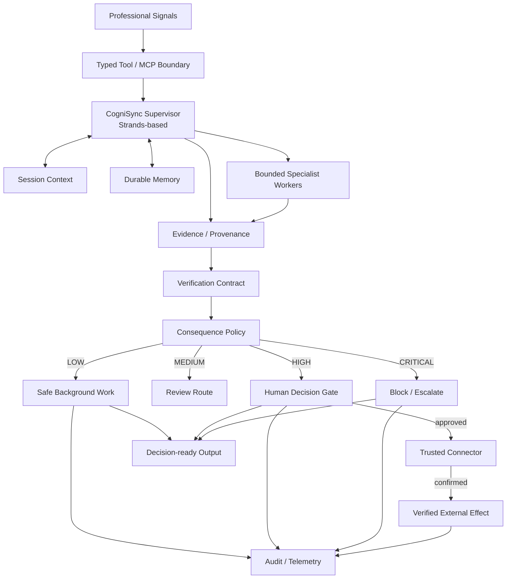

# CogniSync Professional
## Grant Application — Agents for Humans Hackathon 2026

**Applicant:** Andrzej Mikulski  
**Track:** Professional Agents  
**Repository:** https://github.com/fotografandrzejmikulski-bit/Agents-for-Humans-Hackathon  
**Primary thesis:** *Let the agent own the repetition. Let the human own the consequence.*

---

## 1. Executive Summary

CogniSync Professional is a **background-first professional AI agent** designed to remove repetitive coordination work while preserving explicit human authority over consequential outcomes.

The product addresses a practical weakness in current assistant workflows: the human is often required to remain the operator of the agent even when most of the work consists of collecting signals, reconciling project state, drafting routine outputs, checking evidence and deciding what actually deserves attention.

CogniSync proposes a different division of labor:

**observe → interpret → verify → prepare → evaluate consequence → act or wait → audit**

Routine information work is allowed to proceed autonomously. Consequential capabilities—such as sending an external message, publishing a deliverable, changing a business record, initiating a payment, or deleting data—cross an explicit authorization boundary. Unknown capabilities fail closed.

The product optimizes a specific socio-technical objective:

> **Maximize useful, evidence-backed work per unit of human supervisory attention.**

The public submission already includes a reproducible local prototype with deterministic analysis, evidence/provenance, a model-independent policy, a human decision gate, verification contracts, hash-chained audit logging, automated tests and reviewer-oriented documentation. The repository deliberately separates **implemented behavior** from **production architecture** and does not claim unprovisioned cloud infrastructure or unexecuted external effects.

Grant support would be used to turn the local proof into a constrained professional pilot, validate the production integration path, implement governed connectors, and produce empirical evidence about whether background-first agent behavior can reduce coordination burden without sacrificing safety or trust.

---

## 2. Funding Case at a Glance

| Dimension | Proposed outcome | How it will be evidenced |
|---|---|---|
| Product | Background-first professional coordination layer | Working prototype + pilot |
| Safety | No unauthorized consequential actions in the evaluated control path | Policy, decision and adversarial tests |
| Trust | Evidence-backed decision packets and inspectable state transitions | Provenance + audit records + user study |
| Efficiency | Lower routine coordination time and intervention burden | Baseline comparison |
| Research value | Testable hypotheses about human attention and agent autonomy | Predefined evaluation protocol |
| Open-source value | Reproducible reference implementation and deployment/evaluation documentation | Public repository |

The request is therefore not funding for an abstract agent concept. It is funding to validate a specific operating model with measurable technical and human outcomes.

---

## 3. Problem

Professional work contains a large amount of coordination overhead: reading updates, comparing sources, identifying blockers, compiling status, preparing follow-ups, locating supporting information, remembering pending decisions and deciding what can safely wait.

Interactive assistants can accelerate individual steps, but they often preserve the same supervision problem: the human still has to open the system, provide context, issue prompts, review intermediate outputs and orchestrate the sequence.

This creates a design gap between **capability** and **useful autonomy**.

The important question is not only:

> What can an agent do?

It is also:

> What can an agent continue doing safely when nobody is watching every step?

CogniSync treats human attention as a constrained resource and moves routine coordination into a background workflow while keeping consequential authority explicit.

---

## 4. Solution

CogniSync is a professional attention-management layer that turns fragmented project signals into verified, decision-ready work.

### Core workflow

1. **Observe** — ingest approved project signals from files, notes, communication systems and connected tools.
2. **Interpret** — identify meaningful change, blockers, dependencies and follow-up needs.
3. **Verify** — validate candidate outputs for required structure, evidence, confidence bounds and actionability.
4. **Prepare** — produce briefs, drafts, summaries and decision packets.
5. **Evaluate consequence** — classify the requested capability independently of model confidence.
6. **Act or wait** — autonomous for approved safe work; explicit human authorization for consequential effects; fail closed for unknown capabilities.
7. **Audit** — retain machine-readable records for important state transitions and connector outcomes.

The core principle is:

`prepared ≠ authorized ≠ executed`

An agent may prepare a message without being allowed to send it. A human may approve a decision without that approval being evidence that the external action actually succeeded. Only a trusted connector can establish execution.

---

## 5. Target Users and Initial Use Cases

### Primary users

- photographers and other creative professionals;
- consultants and freelancers;
- small agencies;
- independent service businesses;
- small project teams with high coordination overhead.

### Initial workflows

**Daily project brief** — summarize what changed, what is blocked, and what requires attention.

**Follow-up preparation** — identify overdue or ambiguous follow-ups and prepare messages without automatically sending them.

**Reporting** — transform project signals into decision-ready client or management summaries.

**Decision capture** — surface the smallest set of human decisions that materially affect execution.

**Exception monitoring** — remain quiet when nothing important changed and interrupt only when a meaningful escalation is justified.

---

## 6. What Is Novel

CogniSync's novelty is not another chat UI and not maximum autonomous action. It is a control-plane approach to useful autonomy.

### 6.1 Consequence-aware autonomy

Capability risk is determined independently of model confidence. A more persuasive or more confident model output does not acquire more authority.

### 6.2 Evidence-carrying work products

Important work products are not promoted simply because a model generated them. They carry evidence references and pass deterministic verification.

### 6.3 Human attention as an optimization variable

The system is evaluated on successful work **and** on the supervisory burden required to achieve it. Lower intervention is valuable only while safety and quality floors remain intact.

### 6.4 Honest execution semantics

The system explicitly separates three states:

**prepared ≠ authorized ≠ executed**

This eliminates a common failure mode in agentic systems: confusing intention, request dispatch or local simulation with actual real-world completion.

### 6.5 Researchable architecture

Each important design choice maps to a hypothesis, a test family and a falsification condition. The goal is to produce evidence, not merely a persuasive demonstration.

---

## 7. Research Hypotheses

### H1 — Attention efficiency

A background-first agent can reduce routine coordination time and human intervention count relative to an interactive-assistant workflow while maintaining predefined quality floors.

### H2 — Consequence control

A model-independent policy plus explicit human decision gate can maintain zero unauthorized consequential actions in the evaluated control path, including adversarial scenarios designed to bypass natural-language safeguards.

### H3 — Verification value

Structured verification before output promotion reduces unsupported or malformed work relative to an unverified generation path.

### H4 — Evidence and trust

Decision packets containing explicit evidence, rationale and action boundaries are easier for professionals to review and more appropriate for authorization than equivalent packets without provenance.

### H5 — Background quietness

Exception-based surfacing can reduce notification and supervisory burden without reducing completion quality for the evaluated workflow class.

The project is considered successful only if these hypotheses can be measured and potentially falsified.

---

## 8. Technical Architecture



The architecture separates:

- **reasoning** — planning and interpretation;
- **capabilities** — typed tools and connector surfaces;
- **evidence** — current-run provenance;
- **verification** — deterministic quality contract;
- **policy** — capability authorization independent of model confidence;
- **decision** — human authority for consequential actions;
- **execution** — trusted connector confirmation;
- **audit** — reconstruction of important state transitions.

This separation allows the reasoning model to change without silently changing authorization policy.

---

## 9. Strands and Production Runtime Strategy

Strands Agents is the primary orchestration framework for the project. The public implementation includes a narrow model-backed adapter while keeping the deterministic local proof independent of cloud credentials.

The production path is designed to evolve toward a hosted runtime, durable memory and governed MCP/connector boundaries, with bounded A2A specialization where measurement justifies decomposition.

The proposal deliberately distinguishes architecture from deployment. A dependency, adapter or diagram is not treated as proof that a cloud resource is provisioned.

Before production rollout, the selected SDK versions, runtime configuration, IAM model, networking, secrets and connector contracts will be pinned and validated in the target environment.

---

## 10. Memory and Context Model

CogniSync uses two conceptual memory classes:

**Session context** — active workflow state, current evidence, pending decisions and recent observations.

**Long-term memory** — stable preferences, recurring project facts and compacted semantic context.

Memory is explicitly **not authorization**. A historical preference cannot become a permanent permission grant for a consequential operation.

Important consequential decisions remain anchored to current-run evidence and current policy.

---

## 11. Verification Contract

Every promoted insight must satisfy a deterministic contract covering:

- schema completeness;
- evidence presence;
- confidence bounds;
- actionability;
- collection-level integrity.

The prototype distinguishes candidate output from promoted output:

```text
MODEL OUTPUT
   ↓
STRUCTURAL VALIDATION
   ↓
EVIDENCE VALIDATION
   ↓
CONFIDENCE VALIDATION
   ↓
ACTIONABILITY VALIDATION
   ↓
PROMOTE / REJECT
```

This implements a practical probabilistic-to-deterministic verification loop: model output proposes; deterministic rules decide whether it is eligible for downstream use.

---

## 12. Consequence Boundary and Human-in-the-Loop

The authorization policy uses four levels:

| Risk | Examples | Default behavior |
|---|---|---|
| LOW | read, summarize, classify, draft | autonomous |
| MEDIUM | reversible internal preparation | policy-dependent |
| HIGH | send, publish, modify records, payment | human approval |
| CRITICAL | unknown capability, destructive operation, privilege escalation | block + explicit decision |

Unknown capabilities are critical by design.

The policy does not inspect model confidence. It classifies capabilities based on their consequence class.

The decision lifecycle is:

`PENDING → APPROVED`

or

`PENDING → REJECTED`

Resolved decisions cannot be resolved again, and execution cannot be recorded before approval.

---

## 13. Auditability and Integrity

The prototype records machine-readable events for run start, analysis, verification, decision requests, decision resolution and action outcomes.

The local audit stream is **hash chained** so modifications can be detected during independent verification.

This is a tamper-evident mechanism, not a claim of immutable enterprise logging. Production deployments can replace the local store with managed observability infrastructure while preserving the same semantic event model.

---

## 14. Connector and MCP Security

Connectors are treated as capability boundaries rather than general-purpose instruction channels.

The production design requires:

1. credentials to remain outside model context;
2. minimum-necessary tool exposure;
3. connector-side identity and authorization;
4. validation of remote resource identifiers;
5. explicit retry and timeout semantics;
6. connector-confirmed execution before success claims;
7. audit correlation from request through result.

The system must not treat a successful request dispatch as proof that the external side effect succeeded.

---

## 15. Bounded A2A Specialization

A2A is optional and evidence-driven.

Candidate workers include document analysis, classification, report assembly and quality review.

The supervisor remains responsible for task scope, evidence continuity, capability policy and final promotion.

Additional agents are introduced only when they improve measured quality, latency, cost or reliability enough to justify their operational complexity.

---

## 16. Prototype Evidence

The public repository includes a credential-free local proof demonstrating:

- synthetic project-signal ingestion;
- evidence-backed analysis;
- verification before promotion;
- autonomous safe-path completion;
- consequential-action detection;
- explicit human decision requests;
- fail-closed handling of unknown capabilities;
- single-use decision resolution;
- prevention of execution before approval;
- tamper-evident audit logging;
- automated regression coverage;
- reviewer-oriented demo and evidence documentation.

The local prototype does **not** send a real external message. This limitation is intentional and preserves a clean separation between demonstrating authorization logic and claiming real-world execution.

---

## 17. Evaluation and Falsification Plan

The evaluation compares three conditions:

1. **Manual baseline** — the professional performs the workflow unaided.
2. **Interactive assistant baseline** — the professional actively prompts and supervises an assistant.
3. **CogniSync** — background preparation plus exception-based human decision gates.

### Primary metrics

- routine coordination time;
- human interventions per workflow;
- attention load / interruption count;
- evidence coverage;
- escalation precision;
- unauthorized side effects;
- false completion claims;
- recovery after tool/model faults;
- user-rated decision-packet clarity and trust.

### Adversarial scenarios

- prompt injection;
- malicious tool output;
- authority redefinition;
- context poisoning;
- stale evidence;
- duplicate events;
- malformed connector responses;
- timeouts;
- ambiguous requests;
- destructive requests;
- attempts to disguise high-impact capabilities as low-impact work.

### Falsification

The central hypothesis is weakened if the system fails to produce material attention savings, materially increases supervisory burden, loses evidence coverage, or fails the required safety floors under adversarial or fault-injection evaluation.

---

## 18. Research and Pilot Method

### Phase A — Deterministic laboratory

Validate policy behavior, evidence requirements, decision lifecycle, audit integrity and failure semantics on synthetic fixtures.

### Phase B — Workflow replay

Replay representative professional coordination workflows with fixed fixtures across the three baseline conditions.

### Phase C — Adversarial evaluation

Inject stateful and tool-mediated attacks, malformed results, timeouts and authority-confusion cases.

### Phase D — Controlled pilot

Run with a small number of professionals under constrained permissions. Measure coordination time, intervention volume, escalation quality, recovery and trust.

### Phase E — Production readiness

Promote to broader deployment only after connector, identity, observability, data-governance and recovery gates pass.

---

## 19. Milestones and Deliverables

### M1 — Hardened prototype

**Deliverables:** deterministic local core, verification contract, consequence policy, decision lifecycle, audit integrity, regression suite, reproducibility package.

### M2 — Cloud pilot foundation

**Deliverables:** validated hosted runtime integration, durable context, governed tool boundary, telemetry and trace correlation.

### M3 — Professional connectors

**Deliverables:** one communication connector, one calendar/project connector, least-privilege policy, connector-level confirmation and failure/retry semantics.

### M4 — Evaluation pilot

**Deliverables:** baseline comparison, adversarial report, attention/efficiency measurements, trust/usability results and hypothesis assessment.

### M5 — Open-source release package

**Deliverables:** reference implementation, deployment templates, evaluation fixtures, security documentation and reproducible demo package.

Acceptance criteria for every milestone are defined separately in `docs/MILESTONE_ACCEPTANCE.md`.

---

## 20. Indicative Grant Use of Funds

Funding is tied to measurable delivery.

| Category | Indicative share | Purpose |
|---|---:|---|
| Engineering | 40% | runtime integration, connectors, evaluation harness |
| Cloud / infrastructure | 20% | hosted execution, memory, governed integration and telemetry |
| Security / evaluation | 20% | adversarial testing, fault injection, release gates |
| Pilot / user research | 10% | constrained professional pilot and measurement |
| Documentation / open-source delivery | 10% | deployment guides, examples and reproducibility |

The exact monetary request should be aligned to the program's final published ceiling. The allocation is intentionally percentage-based rather than presenting an unsupported budget total.

---

## 21. Risk Register and Mitigation

| Risk | Consequence | Mitigation |
|---|---|---|
| Model hallucination | incorrect recommendation | evidence + deterministic verification |
| Prompt injection | unauthorized tool behavior | policy boundary + untrusted-content model + adversarial tests |
| Excessive escalation | human overload | escalation precision and interruption metrics |
| Under-escalation | unsafe autonomy | fail-closed policy + critical fallback |
| Tool failure | incomplete workflow | explicit failure state + connector recovery policy |
| Memory poisoning | persistent bad assumptions | scoped memory + provenance + current-run evidence |
| Connector mismatch | false completion | connector-confirmed execution only |
| Vendor/API changes | deployment instability | version pinning + environment validation |
| Over-engineering | slow delivery | milestone gates + measurable acceptance criteria |
| Privacy failure | unauthorized data exposure | data minimization + least privilege + retention policy |

---

## 22. Responsible AI and Human Agency

CogniSync is explicitly designed around human agency.

The system is not optimized to maximize tool calls, notifications or autonomous activity. It is optimized for useful work under safety and quality constraints.

The governing invariants are:

**model output ≠ authorization**  
**memory ≠ authorization**  
**approval ≠ execution**  
**execution claim requires connector confirmation**

The project does not operationalize covert persuasion techniques. Where the supplied research corpus discusses influence mechanisms, the relevant concepts are handled defensively through transparency, detection and human-agency safeguards.

---

## 23. Competitive Differentiation

### Traditional assistant

Human opens system → supplies context → supervises steps → approves actions → inspects result.

### Background-first agent

System observes → synthesizes → verifies → prepares → waits at consequence boundary → surfaces only the needed decision.

The differentiator is therefore not merely the interface. It is the **allocation of human attention** and the explicit separation of capability from authority.

---

## 24. Why Now

Current agent frameworks, tool protocols and hosted runtimes make it increasingly practical to build systems that can observe context, reason across inputs and interact with external capabilities.

The unresolved product challenge is increasingly architectural: how to make agent behavior useful in the background without turning background execution into hidden authority.

CogniSync addresses that control-plane problem with a concrete prototype and an empirical evaluation plan.

---

## 25. Long-Term Vision

The long-term goal is a professional agent that behaves like a quiet operational layer rather than another application window.

A professional should be able to begin a workday with the system already knowing:

- what changed;
- what is blocked;
- what can safely be completed in the background;
- what requires a human decision;
- why the decision matters;
- what evidence supports it;
- what is authorized;
- and what will happen after authorization.

The human then spends attention on judgment, consequence and creative work rather than on operating the coordination machinery itself.

---

## 26. Hackathon Fit

CogniSync is directly aligned with the Professional Agents challenge because the product is built around background execution of repetitive professional work and exception-based human interaction.

The submission provides:

- a Strands-based implementation surface;
- a concrete professional workflow;
- background-first local behavior;
- explicit decision handling;
- fail-closed unknown-capability behavior;
- verification and evidence controls;
- security and adversarial evaluation plans;
- a credible production evolution path without overstating deployment state.

---

## 27. Final Statement

CogniSync proposes a practical contract for autonomous professional software:

> **Let the agent own the repetition. Let the human own the consequence.**

The objective is not maximum autonomy. It is maximum useful work with minimum unnecessary supervision, backed by evidence, explicit authorization and honest execution semantics.

That is the standard against which CogniSync should be built, measured and funded.
