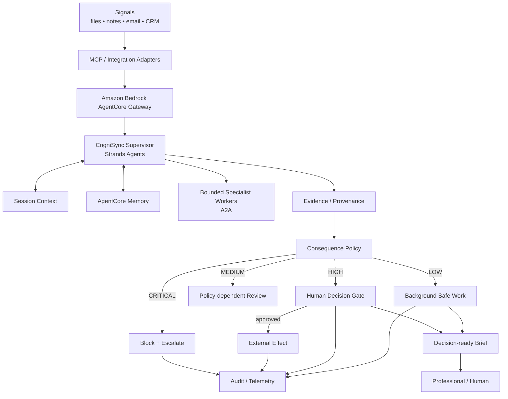

# CogniSync Professional
## Grant Application — Agents for Humans Hackathon 2026

**Applicant:** Andrzej Mikulski  
**Track:** Professional Agents  
**Repository:** https://github.com/fotografandrzejmikulski-bit/Agents-for-Humans-Hackathon

---

## 1. Executive Summary

CogniSync Professional is a background-first AI agent designed to remove repetitive professional coordination work while preserving human authority over consequential decisions.

Instead of making a professional continuously operate an assistant, CogniSync runs a controlled work loop: it gathers project signals, interprets what changed, prepares evidence-backed summaries and follow-ups, detects blockers, and waits at the consequence boundary. Routine information work can proceed autonomously. Sending a message, publishing a deliverable, modifying a business record, making a payment, or deleting information requires explicit authorization.

The thesis is simple: **the agent should absorb repetitive cognitive overhead without becoming another system the human must manage.** Human attention is treated as the scarce resource.

The project targets creators, consultants, freelancers, independent makers and small professional teams. It is implemented around the Strands Agents SDK and designed for production evolution through Amazon Bedrock AgentCore Runtime, AgentCore Memory, AgentCore Gateway/MCP and A2A specialist agents. AWS documents AgentCore Runtime as a secure serverless environment that supports Strands and other frameworks, model flexibility, MCP and A2A communication. citeturn993163search3turn993163search6

The submission is deliberately judgeable: the repository contains a deterministic local prototype, automated tests, explicit safety policy, provenance, audit logging, a human decision gate, a background heartbeat and a documented cloud evolution path. The repository was initially an empty/near-empty project scaffold; the implementation has now been expanded into a coherent, reproducible submission package. fileciteturn2file0L1-L2

---

## 2. Challenge and Opportunity

Professionals rarely lose their day to one enormous task. They lose it to hundreds of small context switches: checking messages, collecting project status, remembering follow-ups, comparing the latest notes, drafting routine reports, finding missing dependencies and deciding what deserves attention.

Existing assistant products frequently invert the intended value proposition. The user must open the assistant, provide context, inspect intermediate steps, approve many actions and repeatedly ask what changed.

CogniSync reverses this workflow:

**Signals → autonomous preparation → evidence → consequence gate → human decision**

The user sees the outcome, not the machinery.

This directly matches the hackathon's published challenge: build an agent with Strands Agents SDK that handles repetitive work in the background and surfaces the human only when a real decision is needed. The Professional Agents track focuses on work such as scheduling, follow-ups and reporting. citeturn993163search1turn993163search8

---

## 3. Target Users

The initial product is optimized for high-context professionals working across several digital systems:

- photographers and other creative professionals managing multiple clients and deliverables;
- consultants and freelancers coordinating projects, decisions and follow-ups;
- small agencies handling reporting and client communication;
- independent service businesses that accumulate administrative work faster than they can review it.

The system is intentionally positioned above existing systems rather than replacing them. Its role is to synthesize their signals into a coherent operating layer.

---

## 4. Product Vision

CogniSync is a **professional attention-management agent**.

The long-term experience is not a chat window waiting for prompts. It is a quiet operational layer that continuously prepares useful work and interrupts the user only when the expected consequence of waiting, approving or rejecting is meaningful.

The product is guided by five principles:

1. **Background first.** Safe work should happen without prompting or notification noise.
2. **Evidence before action.** Important claims carry provenance.
3. **Least privilege.** Access and action scope are deliberately narrow.
4. **Fail closed.** Unknown or consequential side effects are not executed implicitly.
5. **Human attention by exception.** Human interaction is reserved for high-value decisions.

---

## 5. Core Workflow

The agent operates as a closed-loop system:

### Step 1 — Observe

Ingest new signals from files, notes, email, CRM/project systems and future MCP-connected services.

### Step 2 — Interpret

Classify inputs, detect change, identify dependencies and synthesize a current state.

### Step 3 — Prepare

Generate decision-ready summaries, blocker lists, reporting drafts and follow-up proposals.

### Step 4 — Evaluate consequence

Before any side effect, classify the requested operation through the action policy.

### Step 5 — Act or wait

Low-risk preparation proceeds. High-risk operations become explicit human decision requests. Unknown operations are treated as critical risk and remain blocked.

### Step 6 — Learn and audit

Record provenance and audit events, while the production memory layer learns stable preferences and relevant semantic context.

---

## 6. Technical Architecture

The architecture deliberately separates cognition from authorization. The agent can be correct about what should happen and still be prevented from doing it if the operation exceeds its authority.

AgentCore Runtime currently supports long-running agent workloads, session isolation, framework and model flexibility, and MCP/A2A communication. citeturn993163search3turn993163search6 AgentCore Gateway provides a managed MCP boundary with inbound and outbound authorization mechanisms. citeturn903350search7turn903350search8

---

## 7. Strands Agents Foundation

Strands is the primary orchestration framework because it is directly required by the hackathon and maps cleanly to the project's agent-loop model.

The repository's live adapter uses a Bedrock model abstraction rather than hard-coding the entire product around a single provider. The current implementation already exposes `build_strands_agent()` as the cloud integration point. fileciteturn8file0L1-L6

The production architecture should keep the deterministic policy and orchestration layer independent of any one model. This makes it possible to evaluate model substitutions against the same safety and usefulness criteria rather than treating provider selection as a product architecture decision.

---

## 8. Memory Architecture

Professional workflows depend on continuity. A useful agent must know what is currently happening and remember stable context across sessions.

The production design uses two conceptual layers:

- **short-term/session memory** for the active workflow and current conversational context;
- **long-term memory** for persistent preferences, semantic facts and compacted summaries.

AWS documents AgentCore Memory strategies for semantic memory, user preferences and summarization, including integration with Strands. citeturn993163search5

Memory is not treated as unrestricted authority. High-impact decisions must still carry current-run evidence so the human can inspect the immediate basis for the request.

---

## 9. Human-in-the-Loop and Consequence Control

The central safety mechanism is the **consequence boundary**.

CogniSync classifies actions as follows:

| Risk | Examples | Default |
|---|---|---|
| Low | read, classify, summarize, draft | autonomous |
| Medium | reversible internal preparation | policy dependent |
| High | send, publish, modify records, payment | human approval |
| Critical | unknown capability, destructive action, privilege escalation | blocked + human decision |

The repository already contains this fail-closed policy, including explicit high-impact actions and a critical fallback for unknown actions. fileciteturn7file0L1-L6

The strengthened prototype now moves the approval mechanism into a dedicated `DecisionGate` so that policy, audit and resolution are explicit system components rather than incidental CLI behavior.

Crucially, the local demo does **not** pretend that clicking approve sends a real message. The prototype proves the authorization transition; a real external connector remains a separate deployment concern.

---

## 10. MCP and Integration Security

AgentCore Gateway is the integration perimeter for future professional systems.

The gateway supports MCP targets and multiple authorization strategies, including OAuth, IAM-based authorization and API-key credential providers. citeturn903350search1turn903350search8

CogniSync therefore follows a strict principle:

> **Credentials belong at the integration boundary, not in the model context.**

The agent should receive the result of a successful tool invocation, not the secret used to obtain it.

The architecture also avoids treating a discovered remote resource as trustworthy by default. AWS specifically cautions that resource URIs can create SSRF or local-file access risks and recommends allowlisting trusted resource schemes and patterns. citeturn903350search9

---

## 11. Bounded Multi-Agent A2A

CogniSync will use A2A selectively rather than creating an uncontrolled swarm.

A supervisor may delegate narrow workloads such as:

- document structure extraction;
- classification;
- report assembly;
- quality review;
- domain-specific analysis.

AgentCore Runtime currently supports A2A servers, Agent Cards and JSON-RPC interaction; AWS documents Strands-based A2A deployment through `StrandsA2AExecutor` and `serve_a2a`. citeturn993163search2turn993163search7

The architectural rule is simple: **delegate for measurable specialization, latency or cost benefit — not because more agents look more sophisticated.**

---

## 12. Prototype Status

The repository now provides a reproducible local system rather than a documentation-only concept.

Current components include:

- deterministic project ingestion;
- evidence-backed analysis;
- risk-aware action policy;
- centralized human decision gate;
- append-only audit logging;
- background heartbeat scheduler;
- CLI interface and demo mode;
- automated unit tests;
- Strands/Bedrock adapter;
- architecture and demonstration documentation;
- this grant application.

The original project documentation already established the deterministic prototype and explicit distinction between local execution and a future cloud deployment. fileciteturn4file0L2-L6 The enhanced implementation builds on that foundation rather than claiming an AWS deployment that has not actually been provisioned.

---

## 13. Judgeability and Demo Design

The project is designed so that a reviewer can verify the core thesis in minutes.

### Demo A — autonomous background work

Run the local prototype against the synthetic project signal. The agent produces an evidence-backed result and does not generate an unnecessary human interruption.

### Demo B — consequence boundary

Request a real-world-looking external action such as a follow-up message. The system moves into `decision_required` and exposes the action, risk, reason and evidence.

### Demo C — human resolution

Resolve the decision in the local demo. The audit trail records the human choice. No external side effect is falsely claimed.

The source input itself is synthetic and explicitly describes a project with pending accessibility checks, a final copy review, a launch target and a client request for a concise report. fileciteturn16file0L1-L6

---

## 14. Evaluation Framework

CogniSync will be optimized for both **usefulness** and **restraint**.

| Dimension | Metric | Goal |
|---|---|---|
| Productivity | Minutes of repetitive work removed | increase |
| Responsiveness | Signal-to-decision brief latency | decrease |
| Attention | Human interventions per workflow | decrease without quality loss |
| Grounding | Important insights with evidence | increase |
| Safety | Unauthorized external actions | zero |
| Escalation | Correct high-impact escalation rate | increase |
| Efficiency | Cost per completed workflow | decrease |
| Reliability | Successful recovery after faults | increase |
| Trust | Human acceptance of decision packets | increase |

Evaluation scenarios will include normal workflows, ambiguous requests, prompt injection attempts, malformed tool results, duplicate events, tool timeouts, missing context and destructive-action requests.

The Strands evaluation ecosystem provides capabilities relevant to trajectory, tool-use, trace, failure, chaos and adversarial testing. The project will use these classes of tests where supported by the deployed stack.

---

## 15. Responsible AI and Security

CogniSync's security model is deliberately conservative.

**No secret-in-prompt design.** Credentials remain in managed integration boundaries.

**Fail-closed policy.** Unknown operations become critical risk.

**Explicit authorization.** Consequential operations require human resolution.

**Provenance.** Evidence is attached to important insights and decision requests.

**Auditability.** Each run and decision transition is represented as machine-readable audit data.

**Honest completion semantics.** The system must never claim that an external action occurred unless a real connector confirms the result.

**Isolation claims remain precise.** Local mediation is not represented as an OS-level security boundary. Production isolation belongs in the hosted runtime and IAM architecture.

---

## 16. Innovation

The innovation is not "an agent that can do more."

It is an agent that can distinguish between:

- work that should happen automatically;
- work that should be prepared but not executed;
- work that requires explicit authorization;
- work that should be refused.

This creates a new optimization target:

### Useful work per unit of human attention

Most agent systems optimize for task completion, tool-call success or maximum autonomy. CogniSync adds an equally important dimension: **how much supervisory attention does the system consume to achieve the result?**

That makes restraint a measurable product feature.

---

## 17. Competitive Differentiation

### Conventional assistant

Human opens tool → supplies context → manages execution → approves steps → inspects result.

### CogniSync

System gathers context → works in background → synthesizes evidence → evaluates consequence → interrupts only when decision value is high.

The distinction is therefore architectural and behavioral, not cosmetic.

---

## 18. Roadmap

### Phase 1 — Submission-grade prototype

Implemented in the repository:

- local deterministic agent core;
- safety and HITL boundary;
- provenance and audit trail;
- tests and demo flow;
- Strands integration surface;
- production architecture documentation.

### Phase 2 — Cloud pilot

Deploy the supervisor to AgentCore Runtime and connect durable memory. AgentCore's current runtime is explicitly designed for secure serverless agent hosting and supports Strands, MCP and A2A. citeturn993163search6

### Phase 3 — Professional MCP integrations

Start with narrowly scoped integrations for project communication, scheduling, file systems and reporting.

### Phase 4 — Specialist A2A workers

Add only measured specializations that improve cost, latency or quality.

### Phase 5 — Continuous evaluation

Run regression, adversarial and fault-injection suites on every meaningful release.

---

## 19. Requested Grant Support

Grant support would accelerate the project from a reproducible local prototype to a validated professional pilot.

Priority uses are:

1. **Cloud execution and evaluation:** AgentCore Runtime, Memory, Gateway and telemetry.
2. **Connector engineering:** narrowly scoped MCP integrations for real professional workflows.
3. **Safety engineering:** adversarial testing, policy refinement, failure injection and evaluation infrastructure.
4. **Pilot studies:** quantify time saved, notification reduction, intervention precision and user trust.
5. **Open-source delivery:** reusable examples, integration templates and production documentation.

The requested support is therefore tied to measurable technical and product milestones, not to speculative feature expansion.

---

## 20. Hackathon Fit

The Agents for Humans Hackathon is running through **September 14, 2026 at 5:00 p.m. PDT**, with judging ending October 8 and winners announced October 14. It offers $40,000 in cash prizes, and the Professional Agents track targets automation of repetitive professional work such as scheduling, reporting and follow-up. citeturn993163search0turn993163search9

CogniSync is aligned with the published challenge in five ways:

- **Technical implementation:** a real executable Strands-based prototype with a clear AgentCore production path;
- **Design:** background-first operation and exception-based human interaction;
- **Impact:** measurable reductions in routine coordination effort;
- **Originality:** consequence-aware autonomy and human attention as an explicit optimization target;
- **Presentation:** a short, reproducible demo in which the key behavior can be inspected rather than merely asserted.

---

## 21. Final Statement

CogniSync Professional proposes a practical contract between humans and autonomous agents:

**Let the agent own the repetition. Let the human own the consequence.**

A professional should not have to become an operator of the system designed to save them time. CogniSync is built to absorb context collection, synthesis, drafting, classification and monitoring; preserve evidence; learn stable working preferences; collaborate through bounded specialist agents; and stop exactly where human judgment becomes materially important.

The goal is not to remove humans from the loop.

The goal is to remove humans from the parts of the loop that never required them.
